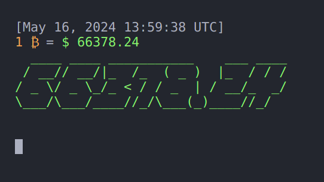

## Description
Real-time Bitcoin 🪙 price tracker in the terminal, utilizing Python and the <a href="https://pypi.org/project/pyfiglet/" target="_blank">pyfiglet</a> library for ASCII art display. The application fetches current Bitcoin price data and displays it in an engaging ASCII art format.

## Installation
```bash
git clone https://github.com/M1ghtyMushroom/BTCBash
cd BTCBash
pip install -r requirements.txt
```

## Usage
```bash
python btcbash.py
```

We welcome contributions from the community! 🎁
